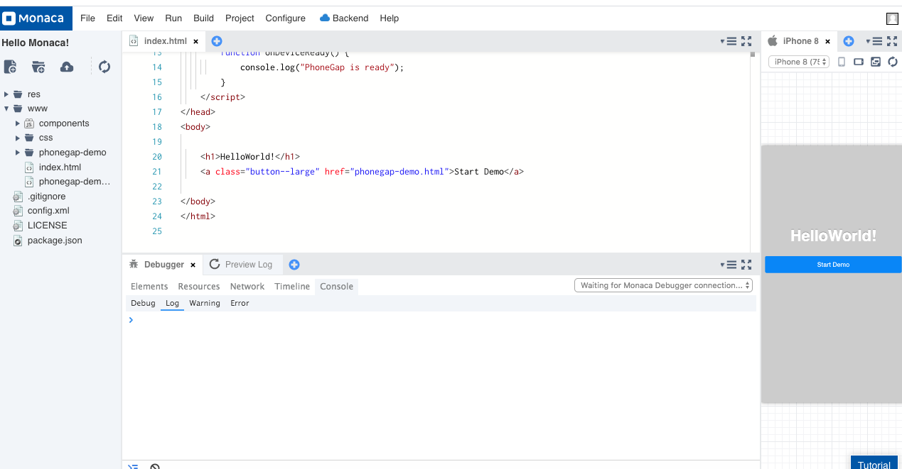
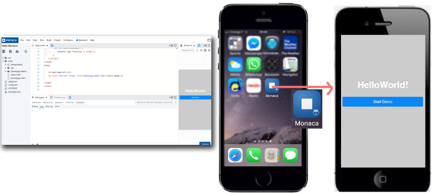
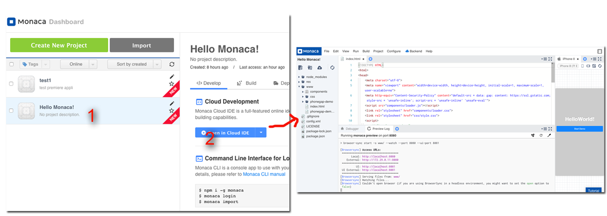
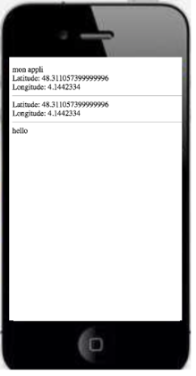

# M4B103-seance-1

### video d'introduction:

 [https://openclassrooms.com/fr/courses/4902061-developpez-une-application-mobile-react-native/4902068-decouvrez-le-developpement-mobile-actuel](https://openclassrooms.com/fr/courses/4902061-developpez-une-application-mobile-react-native/4902068-decouvrez-le-developpement-mobile-actuel)

### les méthodes de dev mobile

#### 1\) le développement natif: 

cela nécessite de développer l'application pour chaque plate-form. En langage Swift ou Objective-C pour IOS, en langage Kotlin ou Java pour Android \(nous ne parlerons pas des autres plate-form\)

Donc, développement long et nécessitant l'apprentissage de 2 langage et de 2 API.

Par contre, le côté positif, c'est que l'appli sera plus réactive car directement codé en langage natif sans interprétation \(vrai surtout pour les grosses appli gourmande en calcul\)

#### 2\) le développement cross-plateform:

le développement se fait avec un language typé web \(html/css/javascript\) associé à des frameworks adaptés au format mobile \(Framework7, jquery mobile, ...\). L'appli est ensuite compilé pour les différentes plateformes \(IOS, android,...\) grace à des outils comme ionic, phonegap, ... Certain outils \(ionic et phonegap par exemple\) sont basés sur le même moteur Cordova \(qui inclus des fonctionnalités  pour accéder à tous les périphériques des téléphone, GPS, accélérometre, camera,...\). voir la doc: [https://cordova.apache.org/docs/fr/latest/guide/overview/](https://cordova.apache.org/docs/fr/latest/guide/overview/). React nativ, lui n'est pas basé sur cordova. Il est plus performant en terme de rapidité car tout en restant cross-plateforme, il fait appel directement aux fonctionnalités nativ sans passer par une interprétation comme le fait cordova. Par contre cela le rend un peu plus complexe pour le développement. 

L'appli cross-plateform est donc moins rapide qu'une version native. \(enfin, surtout pour des appli gourmande en calcul\). Mais le côté positif est que le temps de développement est considérablement réduit car un seul et même développement pour toute les plate-forms et un langage plus classique pour les developpeurs web.

#### Choix de l'outils

pour commencer, nous utiliserons un outils en ligne \(IDE compris!\) basé sur cordova: [https://monaca.io/](https://monaca.io/) .

l'intérêt de cet outils est qu'il utilise cordova \(donc toute la doc associée et la communauté\) et qu'il n'est pas nécessaire d'installer tous les packages nécessaires pour compiler avec cordova \(les SDK des différentes plateforme\). Tout ce fait en ligne, le site propose un serveur virtuel configuré avec tous d'installés \(cordova et les différents SDK\). Son inconvénient: Il est payant, mais une formule free permet de tout faire avec juste des limites de nombre d'appli générées par mois. Gros intérêt aussi, c'est son outil de débug avec la possibilité de voir fonctionner son appli en directe sur son mobile \(et dans un viewer sur le site aussi\)

couplé à l'application "Monaca Dev" \(sur mobile\). Vous bénéficiez en direct du résultat de votre développement sans passer par une compilation et un transfert vers le téléphone via le "store":

#### choix du framework de développement: 

avec l'outil monaca, nous utiliserons "Framework7 avec vuejs pour sa relative simplicité. 

### Exercice 1:

#### Préparation de l'exercice:

ouvrir un compte "free" sur  [https://monaca.io/](https://monaca.io/) .

installer "monaca dev" sur votre mobile.

tester l'application de démo \(Hello Monaca\) disponible sur votre espace de développement de monaca. vérifiez que sur votre mobile \(en ayant lancé "monaca dev"\) l'appli fonctionne: tester le GPS, le vibreur, ...

modifier le source html pour changer le "Hello word" d'accueil. Vérifier que vos changement se répercute sur votre mobile.

### Exercice 2: 

Réalisation d'une appli basique sans framework mais en faisant appel aux fonctionnalités cordova d'accès aux périphériques du mobile \(vibreur et GPS pour ce premier exercice\)

a\) réaliser une application qui affiche les coordonnées GPS en les actualisant régulierement \(voir la doc cordova sur "navigator.geolocation.watchPosition" et "navigator.geolocation.getCurrentPosition" \). 

pour cela nous n'utiliserons pas framework7 pour l'instant mais jquery.

b\) modifier l'application pour faire la même chose sans jquery :-\) 

voir la doc sur document.getElementById et innerHTML...

c\) réaliser une application avec 2 boutons \(un simple div avec une détection de clique en javascript\) :

* un qui fait vibrer le téléphone si on appuis dessus
* un qui affiche les coordonnées si on appuis sur le deuxieme bouton

