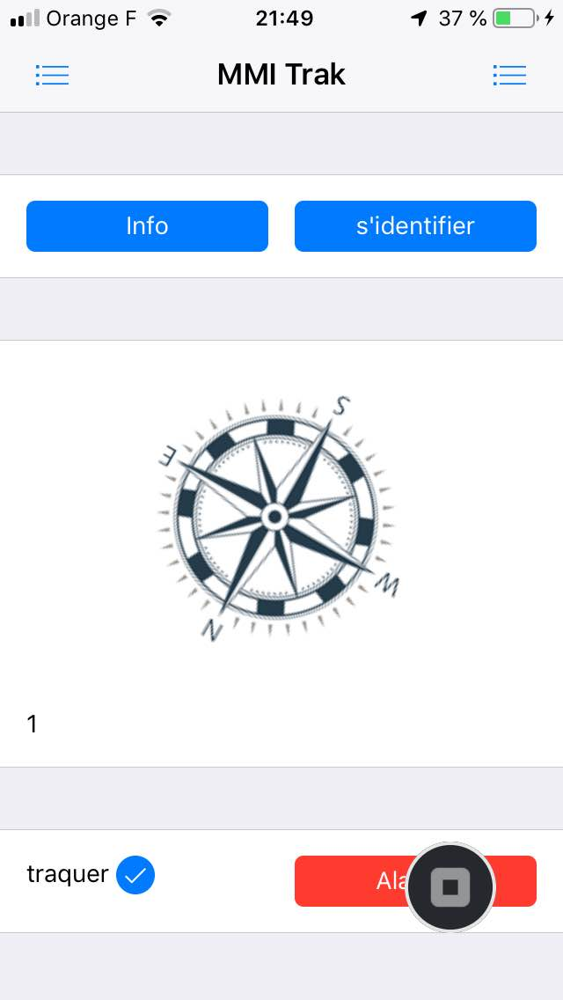

# M4B103-seance-10 \(16 mars 11h\)

### Exercice 1: Remise à plat de la partie front

Nous considérerons que la partie boussole fonctionne. voir la video de correction : [https://youtu.be/92Cz2rECJRQ](https://youtu.be/92Cz2rECJRQ)

### Exercice 2: Gestion du timer avec le bouton d'activation du traker

pour l'instant nous allons tester la gestion de la sauvegarde des coordonnées GPS quand on active le bouton "traquer" \(dans le fichier index.html\). 

```text
...
traquer <input type="checkbox" id="traker"> 
...
```

video de demo du resultat boussole: [https://youtu.be/ZfUWaVEZzak](https://youtu.be/ZfUWaVEZzak)



### mise en place de la sauvegarde toute les 30s \(mettre 5s pour les tests\)

ce que vous devrez obtenir à la fin de cette séance: [https://youtu.be/KLw5z\_e6kBQ](https://youtu.be/KLw5z_e6kBQ)

faite un timer \(toutes les 30s\) qui enverra au final les coordonnées GPS vers votre serveur.

premier test :

```text
var i=0;
setInterval(function(){
    $$('#zoneinfo').html("ça marche :"+i);
    i++;
},5000);


```

vérifiez bien que votre timer fonctionne en lui faisant écrire dans une zone "texte" de votre application. Ici toute les 5s, ensuite on va écrire l'état de la checkbox dans la zone de text \#zoneinfo

```text
setInterval(function(){

    $$('#zoneinfo').html( $$('#traker').prop('checked') );

},10000);
```

une fois que cela fonctionne \(et uniquement si cela fonctionne! ça ne sert à rien d'aller plus loin si cela ne fonctionne pas\), afficher "sauvegarde activé" ou "sauvegarde désactivé" dans la zone de texte \#zoneinfo.

```text
setInterval(function(){
    if($$('#traker').prop('checked')........) {
        $$('#zoneinfo')...;
        }
    else {
        $$('#zoneinfo')....;
        }
},5000);
```

### Récupération des coordonnees GPS toute les 30s \(5s pour vos tests\)

en utilisant le source suivant, vous pouvez récupérer les coordonnées GPS et les afficher dans votre zone \#zoneinfo mais le faire uniquement si la checkbox est True.

```text
setInterval(function(){
    if($$('#traker').prop('checked')........) {
        navigator.geolocation.getCurrentPosition(maPosition);
        }
    else {
        $$('#zoneinfo')...."sauvegarde désactivée" ... ;
        }
},5000);

function maPosition(position) {
    var lat = position.coords.latitude;
    var long = position.coords.longitude;
    $$('#zoneinfo')... lat ... long ... ;
    }
```

vous devez donc voir apparaitre vos coordonnées dans la zone \#zoneinfo mais uniquement si la chekbox est activée.

### Sauvegarde des coordonnées dans la base de données.

pour cela vous pouvez appeler votre API de mise à jours de la table coordonnées. 

Ou au moins pour faire vos tests appeler "http://MONIP/mmitraceur/save.php?longitude=48.5423&latitude=4.6432&iduser=1". Dans ce cas, faites le fichier save.php qui sauve ces infos dans votre table coordonnées. 

Nous allons ici travailler sans l'API \(nous reprendrons la version API plus tard\)

fichier save.php

```text
<?php

$bdd = new PDO(...);

$iduser = $_GET['iduser'];

$long=$_GET['...'];

$...=$_GET['...'];

$requete="INSERT INTO traceur(participeid_id,longitude,latitude) VALUES($iduser,'$long','$lat')";

echo "sauvegarde faite";

$bdd->query($requete);

?>
```

tester le bon fonctionnement de votre miniAPI \(save.php\) directement avec une url:

[http://xxxxx/mmiTrack/save.php?long=55&lat=33&iduser=1](http://149.91.88.82/fabrice/mobile/mmiTrack/save.php?long=55&lat=33&iduser=1)

### sauvegarde via l'application

pour envoyer les datas dans votre application vous pouvez utiliser:

```text
...
Framework7.request.get('http://149....82/mmiTrack/save.php?longi=48...&lat=...&iduser=1', function(data) {...});
...
```

pour l'Id de l'utilisateur nous allons pour l'instant mettre toujours 1. \(nous allons traquer un seul utilisateur pour l'instant\)

le resultat à avoir: [https://youtu.be/KLw5z\_e6kBQ](https://youtu.be/KLw5z_e6kBQ)

### A rendre en fin de seance par moodle \(voir partie depot\)

un fichier zip contenant:

un screenshot de votre environnement de dev Monaca ouvert avec votre app.js

le fichier index.html et le fichier app.js

