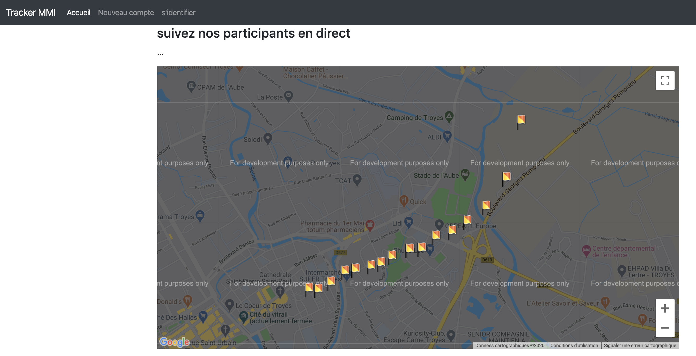
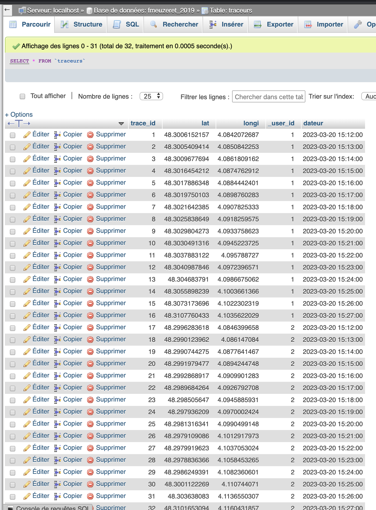
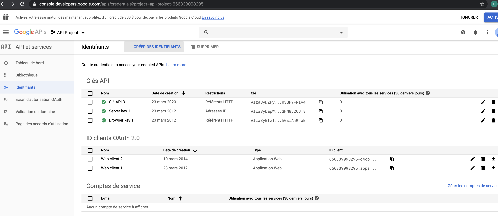
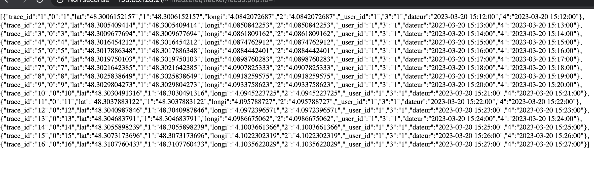
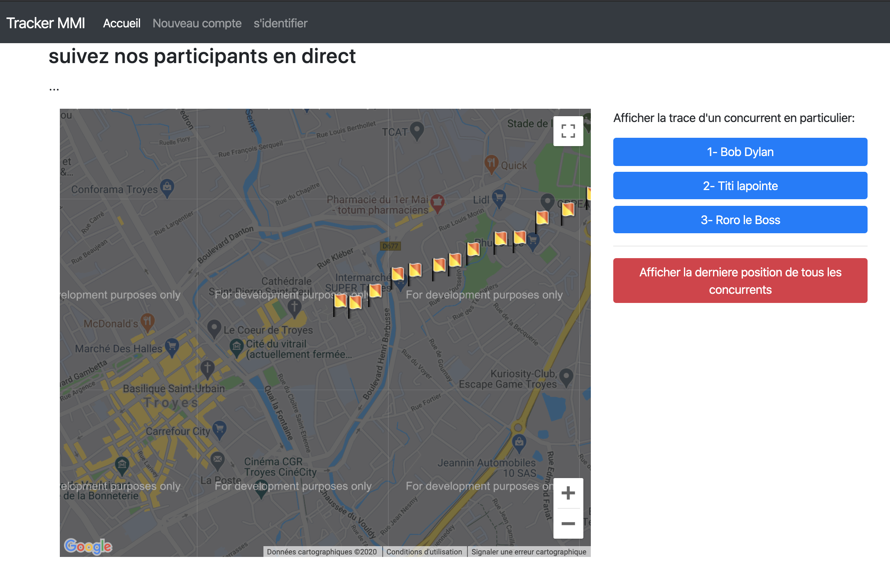

# M4B103-seance-11 \(10 mars\)

correction séance précédente \(seance 10\): [https://youtu.be/1K5LC1eN8vA](https://youtu.be/1K5LC1eN8vA)

## Partie Carte de suivi des concurrents 

cette partie peut etre faite même si votre appli mobile ne sauve pas encore vos données GPS



## Exercice 1

Nous allons ici nous intéresser à l'API de google map pour afficher nos coureurs.  

Mais pour l'instant nous allons commencer à afficher toutes les traces d'un des participants \(le seul id que nous avons stocké dans la base de données avec notre téléphone.

Assurez vous d'avoir quelques traces de rentrées dans votre base de données:



Tester déjà l'affichage d'une map \(centrée sur Troyes\)  et d'un marqueur \(un point sur la carte\) avec l'api de google:

```text
<!DOCTYPE html>
<html>
<head><title>tracker</title>
<style type="text/css">
	#map { height: 600px }
</style>
</head>
<body>
<h1>Tracker de course MMI</h1>
<h3>suivez nos participants en direct</h3>

<div id="map">	... </div>

<script src="https://code.jquery.com/jquery-3.4.1.slim.min.js" ></script>

<script type="text/javascript"
     src="http://maps.googleapis.com/maps/api/js?sensor=false"></script>

<script type="text/javascript">
	
	$(document).ready(function(){

		 var map = new google.maps.Map(document.getElementById('map'), {
    zoom: 15,
    center:  {lat: 48.3, lng: 4.0833}
  });


 	 new google.maps.Marker({
    position: {lat: 48.3009677693572, lng: 4.08618091623638} ,
    map: map
  }); 

	})

	

</script>

</body>
</html>
```

cet exemple doit fonctionner en mode 'développeur' \(avec un trademarke sur l'image\) car nous n'avons pas utilisé une 'api Key' pour l'exploiter.  cette api key est récupérable dans la console de google mais il est nécessaire d'ouvrir un compte facturable. Je vous montre l'interface ci-dessous, mais vu les conditions actuelles d'enseignement nous ne prendrons pas le temps de vous ouvrir des comptes, nous resterons donc en mode 'developpeur'.  Vous pourrez de votre côté regarder comment fonctionne la mise en place d'une api Key. voir: [https://cloud.google.com/docs/authentication/api-keys?hl=Fr&visit\_id=637205730503214335-1912155874&rd=1](https://cloud.google.com/docs/authentication/api-keys?hl=Fr&visit_id=637205730503214335-1912155874&rd=1)



### Ajouter des marqueurs

documentation sur l'API google map et ses marqueurs: [https://developers.google.com/maps/documentation/javascript/markers?hl=fr](https://developers.google.com/maps/documentation/javascript/markers?hl=fr)

Voici un exemple d'affichage de plusieurs marqueurs depuis un tableau \(testez le\)

```text
	
$(document).ready(function(){

  var map = new google.maps.Map(document.getElementById('map'), {
        zoom: 15,
        center: {lat: 48.3, lng: 4.0833}
        });
 
 var liste = [
 {lat: 48.3006152156664, lng: 4.08420726868151},
{lat: 48.30054094142, lng: 4.08508422532},
{lat: 48.3009677693572, lng: 4.08618091623638},
{lat: 48.3016454212265, lng: 4.08747629121272},
{lat: 48.3017886348277, lng: 4.08844424011603},
{lat: 48.3019750103203, lng: 4.08987602832933},
{lat: 48.3021642385429, lng: 4.09078253332421},
{lat: 48.3025838648958, lng: 4.09182595752635},
{lat: 48.302980427332, lng: 4.09337586230076},
{lat: 48.3030491316128, lng: 4.09452237252864},
{lat: 48.3037883121633, lng: 4.09578872699952},
{lat: 48.3040987846303, lng: 4.09723965711012},
{lat: 48.3046837910041, lng: 4.09866750618299},
{lat: 48.3055898238725, lng: 4.10036613663182},
{lat: 48.3073173696393, lng: 4.1022302318956},
{lat: 48.3107760432586, lng: 4.10356220290102}
 ];


 liste.forEach( function(item){

   new google.maps.Marker({
    position: item ,
    map: map
    });
     
  });
  
  });
```

### Modification de l'image d'un marqueur:

```text

 new google.maps.Marker({
    position: item ,
    map: map,
    icon: 'beachflag.png'
  });
```

l'image doit etre un png de 20px sur 32px.

Modifiez votre carte pour avoir des marqueurs différents de celui par defaut

## Exercice 2

Assurez vous d'avoir des données de sauvegardées dans votre table "traceurs" 


si vous n'avez pas encore de data dans votre base, vous pouvez en récupérer ici



créez un fichier recup.php qui permet d'afficher les données de la table "traceur" sous forme d'un json en fonction de l'id passé dans l'url  \(ex:    http://........recup.php?id=1  \)

```text
<?php

$bd = new PDO(........);

$id=$_GET['id'];

$requete = 'SELECT * FROM traceurs where _user_id=' . $id ;

$tous = $bd->query($requete);

$tableau=$tous->fetchAll();

echo json_encode($tableau);

?>
```



modifiez la page de la carte google de maniere à afficher les données récupérées par recup.php à la place du tableau écrit en dur dans l'exercice 1.  recup.php devra récupérer les informations du coureur dont l'id sera passée dans l'URL  \(ex:    http://........recup.php?id=1  \)

### Exercice 3

Proposez sur le site la possibilité:  



1\)soit d'afficher la trace d'un des concurrents en particulier en cliquant  sur une liste des concurrents afficher sur la page \(ici à droite en bleu\)

2\) soit d'afficher la derniere position de tous les concurrents \(ici le bouton rouge\) \(assurez vous d'avoir plusieurs enregistrements pour plusieurs concurrents\)

3\) réflechir à un systeme qui permettrait de rafraichir régulièrement la carte \(toute les 30s\) pour voir les marqueurs des concurrents évoluer.

## rendu fin de seance

avant 11h30 vous devez déposer sur moodle \(module M4B103devMobile\) un fichier texte contenant l'URL de votre site tracker:   peut importe l'avancée, ce lien sert uniquement à accéder à votre travail fait ou à venir.

