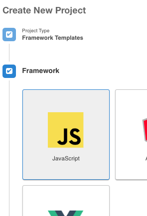
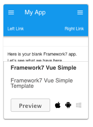
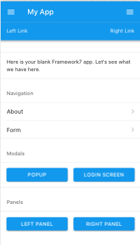
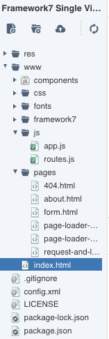

# M4B103-seance-3

Framework7 va vous offrir tout un arsenal d'outils pour développer votre appli mobile avec des popups, des menus déroulants, des panneaux , des formulaires, des calendriers... le tout adapté aux mobiles et à son ergonomie, à travers des classes CSS et du javascript . \( comme bootstrap  pour le dev web\) . La partie dev js est structurée un peu comme du vuejs. Vous avez aussi la même \(ou presque\) syntaxe que jquery pour accéder aux éléméents du DOM: $$\("\#idElement"\).html\(...\) ... 

[https://framework7.io/docs/](https://framework7.io/docs/)

Remarque: tout comme bootstrap, il faut apprendre à connaitre les différentes classes des différents éléments \(popup, bouton, panel...\) ainsi que la structuration des éléments \(équivalent des rows/cols et grids sous bootstrap par exemple\)

### Exercice 1:

#### utilisation de framework7 pour "looker" l'application en mode mobile

Avec l'outils monaca, créez un projet en choisissant un model basique basé sous Framework7 \(permet d'installer tous les packages nécessaires en un clique\)





### application créée par ce projet: 

tester l'ergonomie de cette application sur l'émulateur et sur votre mobile



structure de l'application avec ses librairies de Framework7 installées:



sauvegardez sur votre machine le source html proposé \(pour garder l'exemple\) et remplacez le par le code minimum suivant:

```text
...
<body>
<div id="app">

  <div class="view view-main ios-edges">
    
    <div class="page" data-name="home">
        
        <div class="page-content">    
          Top Run Game ...
        </div> 

    </div>

  </div>

</div>

</body>
...
```

ceci est le corps minimum d'une appli FrameWork7

Maintenant vous pouvez ajouter des éléments type mobile \(panneau latéraux, fenetre popup...\). Ces éléments d'ajoute en début d'application \(app\) sous forme de div avec des classe spécifique \(ex: panel panel left pour un panneau latéral gauche\)

vous pouvez ajouter des panneaux latéraux gauche et/ou droit:

```text
...
<div id="app">

 <div class="panel panel-left panel-reveal theme-dark">
   <div class="view">
        <div class="page">
          <div class="page-content">
            ici un debut de panneau gauche...
          </div>
        </div>
      </div>
    </div>
 ....   
```

dans la page principale vous devez rajouter un 'bouton' pour "actionner le panneau gauche:

```text
<a href="#" class="button button-raised button-fill panel-open" data-panel="left">
ouvrir le panneau de gauche
</a>
```

ajout d'un popup mobile: \(et de son bouton de fermeture\)

```text
...
<div id="app">

  <div class="popup" id="mon-popup">
      <div class="view">
        <div class="page">

          <div class="page-content">
            
              <p>Bob</p>
          <p><a href="#" class="link popup-close">Close</a></p>
          </div>
        </div>
      </div>
    </div>
...
```

ajouter un lien sur la 'page principale' pour activer le popup

```text
 <a href="#" class="button button-raised button-fill popup-open" data-popup="#mon-popup">
 Ouvrir mon Popup
 </a>
```

vous pouvez ajouter une barre de navigation à votre application:

à insérer juste avant  &lt;div class="page" data-name="home"&gt;

```text
<div class="navbar">
          <div class="navbar-inner">
            <div class="title sliding">MMI Power</div>
          </div>
        </div>
```

Vous pouvez aussi lancer une fonction lors du clique sur un bouton. Pour cela vous pouvez mettre un id \(ex: 'monBouton' \)au bouton et dans le fichier app.js ajouter 

```text
$$('#monBouton').on('click', function () {
     alert('Hello les MMI');
});
```

vous pouvez accéder aux éléments du DOM comme avec jquery:

```text
$$('#monBouton').on('click', function () {
     $$('#maZoneMessage').html("hello");
});
```

#### en résumer: simplifier les fichiers proposés \(js et html\) avant de commencer votre application

```text
...
<body>
  <div id="app"> 

    <!-- Your main view, should have "view-main" class -->
    <div class="view view-main ios-edges">
      <!-- Page, data-name contains page name which can be used in callbacks -->
      <div class="page" data-name="home">
        <!-- Top Navbar -->
        <div class="navbar">
          <div class="navbar-inner">
            <div class="title sliding">MMI Power</div>
          </div>
        </div>

        <!-- Scrollable page content-->
        <div class="page-content">
          <div class="block block-strong">
            <p>Top Run Game</p>
          </div> 

            <div class="row">
              <div class="col-50">
                <a href="#" class="button button-raised button-fill panel-open" data-panel="left">Un peu d'info</a>
              </div>   
            </div>
              
        </div>
      </div>
    </div>
  </div>

  <!-- Framework7 library -->
  <script src="framework7/js/framework7.min.js"></script>
  <!-- Monaca JS library -->
  <script src="components/loader.js"></script>
  <!-- App routes -->
  <script src="js/routes.js"></script>
  <!-- Your custom app scripts -->
  <script src="js/app.js"></script>
</body>
...
```

faites la même chose avec le fichier app.js:

```text
// Dom7
var $$ = Dom7;

// Framework7 App main instance
var app  = new Framework7({
  root: '#app', // App root element
  id: 'io.framework7.mmi', // App bundle ID
  name: 'MMI', // App name
  theme: 'auto', // Automatic theme detection
  // App routes
  routes: routes
});

// Init/Create main view
var mainView = app.views.create('.view-main', {
  url: '/'
});
```

### Exercice 2:

en partant de ce projet simplifié, relookez votre application "Game of Run" 

* utilisez un panel left pour changer le temps maxi et le choix de l'orientation du déplacement \(nord/sud/est/ouest\)
* vous pouvez reprendre le code source proposé au démarrage par le projet monaca pour tester les différents éléments \(popups, menu, barre de nav ...\) et leurs codes sources.

