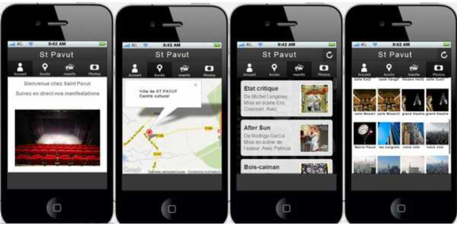

# M4B103-seance-4

### Exercice :

développez une version mobile \(avec Framework7\) de St pavut en 4 "pages": accueil, plan, manifestation, salles

### préparation de l'API st pavut

dans votre projet St pavut, créer une methode dataManif dans le controleur Manifestation. cette methode doit renvoyer un fichier JSON avec la liste des manifestations \(titre, description, lien photo....\)

### Récupération des manifestations dans l'appli mobile

faire appelle à dataManif pour récupérer les données et afficher l'ensemble des manifestations dans votre application

### Complément

faites la meme démarche pour la liste des salles 

