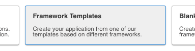
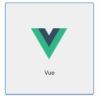
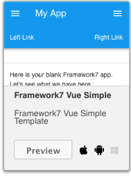

# M4B103-seance-5

Nous allons ici voir comment utiliser vue js avec Framework7.

Il faudra déjà installer Vuejs et indiquer à Framework7 qu'il va fonctionner avec vuejs \( Framework7.use\(Framework7Vue\); \)

### Mise en oeuvre

Commencer un nouveau projet sous monaca: spécifier un projet avec Framework7 et VueJs \(cela vous installera tous les ressources nécessaire pour faire du Framework7 et du VueJs\)







Vérifiez que ce projet d'exemple fonctionne sur votre mobile


Faite une copie de ce projet d'exemple en local sur votre machine \(index.html et app.js\)

Gardez le minimum de app.js et de index.html:

app.js:

```text
// Init F7 Vue Plugin
Framework7.use(Framework7Vue);

// Init App
var mavue1 = new Vue({
  el: '#app',  
  data: function () {
    return {
      // Framework7 parameters here
      f7params: {
        root: '#app', // App root element
        id: 'io.framework7.testapp', // App bundle ID
        name: 'Framework7', // App name
        theme: 'auto', // Automatic theme detection        
      },      
    }
  },
});
```

index.html:

```text
...
<body>
  <div id="app">
    <f7-app :params="f7params">
      <f7-view id="main-view" main>
        <f7-page>
          <f7-navbar>       
            <f7-nav-title>MMI power</f7-nav-title>      
          </f7-navbar>
 
  <p>mon appli FRamework7 + VueJs</p>

        </f7-page>
      </f7-view>

    </f7-app>
  </div>

  <!-- Framework7 library -->
  <script src="libs/framework7/js/framework7.min.js"></script>

  <!-- Vue -->
  <script src="libs/vue/vue.min.js"></script>
   
  <!-- Framework7-Vue plugin -->
  <script src="libs/framework7-vue/framework7-vue.min.js"></script>


  <!-- Your custom app scripts -->
  <script src="js/app.js"></script>
</body>
</html>
```

Ajoutons maintenant une methode vueJS dans le fichier app.js

```text
 ...
 el: '#app',
  methods: {
    monaction: function() {  
     
           alert("go!");
       }
  },
  data: f...
```

Ajoutons un bouton \(ou un lien\) dans index.html qui appelera cette méthode:

```text
...
<button @click="monAction">lancer!</button>
...
```

Vérifiez que cela fonctionne

### Utilisez une liste synchronisée avec une data de vueJs

Comme dans l'exercice du module M4X201, créez une variable contacts avec ici seulement 2 ou 3 éléments dedans:

```text
 ...
 data: function () {
    return {
      // Framework7 parameters here
      f7params: {
       ...
      },
      contacts: [{"manif_id":"1","manif_intitule":"test"}, {"manif_id":"2","manif_intitule":"test2"}]
    }
    ...
  
```

dans index.html, créez la liste permettant d'afficher ces éléments:

```text
...
<ul>
  <li v-for="... in ..."> {{ ...  }} </li>
</ul>
```

testez le bon affichage de ces datas dans votre appli mobile

### Récupérer les datas en JSON sur un serveur extérieur

Modifiez votre application pour que lorsque l'on clique sur votre bouton "lancer!" votre programme récupère les données des manifestations de stpavut et les affiches dans votre liste.

pour cela vous pouvez utiliser la méthode: 

```text
Framework7.request.json(...,function(reponse){ ... })

```

Notez qu'il faudra écrire la 'reponse' dans la variable 'contacts' déclarée dans les data de l'objet VueJs. Pour cela vous pouvez utiliser la syntaxe suivante

```text
...
mavue1.contacts = reponse ; 
// mavue1 étant mon instance de mon object vueJs
...
```

Vérifiez que lorsque vous cliquez sur le bouton "lancer!" vous obtenez bien la liste des manifestations.

Mettez en forme cette liste en utilisant les styles de Framework7 \(vous pouvez aussi afficher cette liste sous une autre forme que des ul/li\)

### Réalisez l'application permettant d'afficher les différentes informations de StPavut


