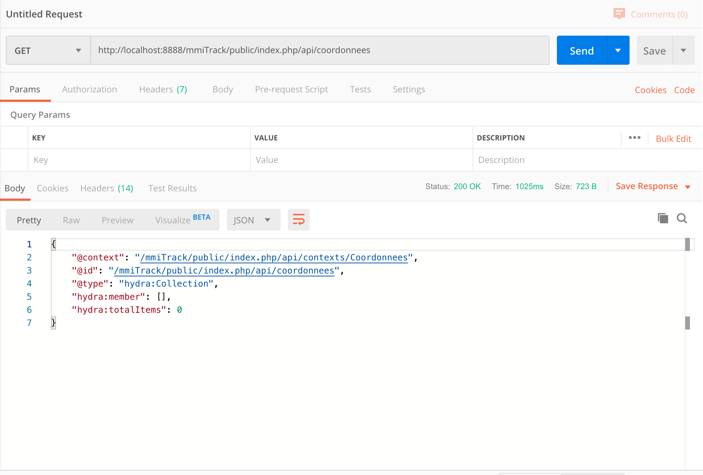

# M4B103-seance-6 \(2 mars\)

Réalisation d'une application "suivi de course". L'application doit permettre à un groupe de participants à une manifestation, d'être suivi en direct sur une map sur un  site web


1\) réaliser sur votre VPS, un site où il sera possible de s'inscrire \(login password, pseudo, code d'accès\)

2\) réaliser l'appli mobile qui permettra de récupérer les coordonnées GPS du mobile et de les envoyer toutes les 30s vers le site du VPS. 


Le site sur le VPS sera à réaliser avec Symfony \(installation skeleton\), sur lequel on viendra mettre en place [ApiPlatform](https://api-platform.com/) afin de fournir une API REST. Cette partie est décrite dans la dernière section de cette séance.


L'appli devra permettre de saisir son login et son password \(établi lors de l'inscription sur le site\)  pour autoriser la sauvegarde des datas sur le VPS toutes les 30s dans une Bd sur le VPS. 

L'appli devra avoir une partie avec une boussole visible et fonctionnel.


Un bouton "Alarme" doit être bien visible sur l'appli, l'appuis sur ce bouton doit envoyer une alarme sur le serveur VPS qui doit être visible sur la map globale.

Vérifiez que votre application mobile sauvegarde bien les différentes data dans vote Bd sur votre VPS, ainsi que les infos comme l'appuis sur le bouton "alarme"


### Partie affichage sur le site via google map


réalisez la partie sur le site web permettant de suivre les participants via google map. Pour cela étudiez l'API de google map et proposer la visualisation des différents participants

source minimum pour utiliser l'API google map:

```markup
<!DOCTYPE html>
<html>
<head>
<title>MMI</title>
<meta charset="UTF-8">
<meta name="viewport" content="initial-scale=1.0, user-scalable=no" />
<script type="text/javascript" src="http://maps.google.com/maps/api/js"></script>
<script type="text/javascript">
function initialiser() {
    var latlng = new google.maps.LatLng(48, 4);
    var options = {
        center: latlng,
        zoom: 10,
        mapTypeId: google.maps.MapTypeId.ROADMAP
    };
    var carte = new google.maps.Map(document.getElementById("macarte"), options);
    var marqueur = new google.maps.Marker({
        position: new google.maps.LatLng(48.023, 4.01
        map: carte
    });
}
</script>
</head>
<body onload="initialiser()">
<div id="macarte" style="width:600px; height:600px"></div>
</body>
</html>
```

lien de présentation de l'API google map: [https://thecodingmachine.developpez.com/tutoriels/javascript/introduction-api-google-maps/](https://thecodingmachine.developpez.com/tutoriels/javascript/introduction-api-google-maps/)

### traitement des données spécifiques \(alarme, absence de mouvement, absence d'envois d'info\)

Les participants qui n'ont pas envoyé leurs coordonnées depuis plus de 10minutes apparaissent avec une couleur particulière sur la map.

Les participants qui n'ont pas bougé depuis plus de 15 minutes doivent aussi apparaitre avec une couleur particuliere.

Les participants ayant activé "Alarme" doivent apparaitre clairement avec une couleur

### Variante "course"

Sur le site web \(ou via une appli mobile specifique\), un administrateur pourra "lancer" la course: dans ce cas un point cible apparaitra sur la boussole des participants avec une indication de direction et une distance. Pour gagner la course il suffira d'arrivée sur le point cible \(à 10m pret\). Le classement devra apparaitre automatiquement sur le site ainsi que dans une zone "info course" sur les mobiles des participants.


Une zone "info en continue" devra aussi apparaitre sur les mobiles des participants. Cette zone permettra d'afficher des info envoyé par l'admin de la course

### Symfony Et API-Platform

Comme l'application est simple, on peut considérer de travailler directement sur le VPS pour cette partie.

Placez vous dans votre répertoire www \(ou public\_html\), et installez une nouvelle fois Symfony

```bash
composer create-project symfony/skeleton mmiTrack
cd mmiTrack/
```

Une fois l'installation terminée, et que vous êtes dans le dossier du nouveau projet, il faut configurer la BDD avec vos informations, et installer API-Platform, qui est un bundle Symfony.

```bash
composer require api #pour installer API-Platform
composer require maker --dev #pour avoir les commandes pour générer du code
cp .env .env.local
nano .env.local #pour éditer les informations de la BDD
bin/console doctrine:database:create #création de la base de données
```


Sur les VPS MMI, on vous a demandé d'avoir un utilisateur par base de données. Vous devez donc avant de mettre à jour la base de données créer un utilisateur \(mmitrack\) par exemple, et la base de données associées \(mmitrack par exemple\), et utiliser cet utilisateur dans votre fichier .env.local

Comme la base existera déjà, vous n'avez pas à exécuter la commande  `bin/console doctrine:database:create`


Le projet comporte deux entités une avec l'utilisateur, une avec les données GPS. Pour créer la partie utilisateur \(qui gérera la connexion\), on peut utiliser le maker qui permet de créer une entité User \(ou un autre nom\), avec la configuration nécessaire pour gérer le mot de passe, son cryptage, le login. Vous pouvez ensuite ajouter tous les champs que vous le souhaitez en faisant un `make:entity` ou en modifiant la classe générée.

```bash
bin/console make:user

 The name of the security user class (e.g. User) [User]:
 > User #Vous pouvez modifier le nom de l'entité créée

 Do you want to store user data in the database (via Doctrine)? (yes/no) [yes]:
 > yes # pour gérer les utilisateurs avec la base de données

 Enter a property name that will be the unique "display" name for the user (e.g. email, username, uuid) [email]:
 > username #l'identifiant unique pour se connecter

 Will this app need to hash/check user passwords? Choose No if passwords are not needed or will be checked/hashed by some other system (e.g. a single sign-on server).

 Does this app need to hash/check user passwords? (yes/no) [yes]:
 > yes #Voulez vous crypter le mot de passe

 created: src/Entity/User.php
 created: src/Repository/UserRepository.php
 updated: src/Entity/User.php
 updated: config/packages/security.yaml

           
  Success! 
           

 Next Steps:
   - Review your new App\Entity\User class.
   - Use make:entity to add more fields to your User entity and then run make:migration.
   - Create a way to authenticate! See https://symfony.com/doc/current/security.html
```


Attention, si vous utilisez Mariadb &lt; 10.2.3, le type json n'est pas autorisé.

Vous devez modifier l'entité User.php comme ci-dessous :



Remplacer la définition de la propriété par : 


```php
/**
* - @ORM\Column(type="json") // à supprimer
* + @ORM\Column(type="text") // à ajouter
*/
private $roles = [];
```




Puis le getters et setters par :


```php
public function getRoles(): array
    {
        $roles = json_decode($this->roles);
        // guarantee every user at least has ROLE_USER
        $roles[] = 'ROLE_USER';

        return array_unique($roles);
    }

    public function setRoles(array $roles): self
    {
        $this->roles = json_encode($roles);

        return $this;
    }
```



Ensuite, vous pouvez créer la seconde table avec la console \(`bin/console make:entity`\), et créer la liaison avec l'entité User \(ou un autre nom selon l'étape précédente\).

Lors de la création d'une nouvelle entité, et parce que Api-Platform est installé, vous avez une question supplémentaire :

```bash
 Mark this class as an API Platform resource (expose a CRUD API for it) (yes/no) [no]:
```

Répondez "yes" afin que cette entité soit géré en tant que source de données pour votre API. Si vous oubliez cette étape, ou si vous souhaitez le faire sur une entité déjà existante il faut ajouter les lignes ci dessous dans votre fichier PHP :

```php
<?php
// api/src/Entity/VotreEntite.php

namespace App\Entity;

use ApiPlatform\Core\Annotation\ApiResource;

/**
 * ...
 *
 * @ApiResource
 */
class VotreEntite
{
    // ...
}
```

N'oubliez pas de mettre à jour la base de données avec les tables crées en exécutant la commande

```bash
bin/console doctrine:schema:update -f
```


Si vous rencontrez une erreur lors du 

```bash
bin/console doctrine:schema:update -f
```

qui évoque un problème avec utf8mb4\_unicode...

Remplacez le contenu de votre fichier config/packages/doctrine.yaml par celui ci-dessous :



```yaml
doctrine:
    dbal:
        url: '%env(resolve:DATABASE_URL)%'
        charset: utf8mb4
        default_table_options:
            charset: utf8mb4
            collate: utf8mb4_unicode_ci
        # IMPORTANT: You MUST configure your server version,
        # either here or in the DATABASE_URL env var (see .env file)
        #server_version: '5.7'
    orm:
        auto_generate_proxy_classes: true
        naming_strategy: doctrine.orm.naming_strategy.underscore_number_aware
        auto_mapping: true
        mappings:
            App:
                is_bundle: false
                type: annotation
                dir: '%kernel.project_dir%/src/Entity'
                prefix: 'App\Entity'
                alias: App
```



Une fois toutes ces étapes faites, sans erreur, vous pouvez vous rendre sur l'URL suivante : [http://localhost:8888/mmiTrack/public/index.php/api](http://localhost:8888/mmiTrack/public/index.php/api) \(a adapter selon votre serveur !!\), vous devriez avoir la page suivante :


Cette vous donne une documentation qui permet de tester votre API, en listant les données \(GET\), en en ajoutant \(POST\), en récupérant un élément \(GET avec id\), en supprimant \(DELETE\), ou en mettant à jour des informations \(PUT\).

Vous pouvez tester directement depuis cette page le bon fonctionnement, et l'ajout, la modification ou la suppression de données.

#### Utilisation de PostMan

Cependant, nous allons utiliser [PostMan](https://www.postman.com/) afin d'effectuer des tests et de trouver les requêtes qui vous seront nécessaires pour l'application mobile. Postman propose une version gratuite permettant de tester une API.

Un premier test pourrait ressembler à la vue ci-dessous pour récupérer les données de la table coordonnées.



Le résultat est vide car la table ne contient aucune données. Ajoutez un utilisateur et des coordonnées et refaite un essai pour voir la réponse fournie par Api-platform. 


Les informations retournées par Api-platform sont très complètes, elles comprennent :

* le contexte, l'id et le type, qui sont des informations pour faire de la sémantique du web \(non indispensable pour ce module\)
* hydra:member contient les informations de la base de données.
  * @id et @type, sont une nouvelle fois des informations sémantiques, mais @id est aussi l'URL de votre donnée. C'est notamment une information interessante pour faire des liens.
  * Vous avez ensuite les données directement issues de la table coordonnées, puis les données provenant de la liaison entre les coordonnées et l'utilisateur.
* hydra:totalItems indique le nombre d'enregistrement retourné.

#### Exercices

1. En utilisant la documentation sur Api-platform, et Postman, essayez de trouver les requêtes afin d'ajouter des données dans la table coordonnées \(on peut considérer l'utilisateur avec son Id.
2. Ajouter la table User dans Api-platform

