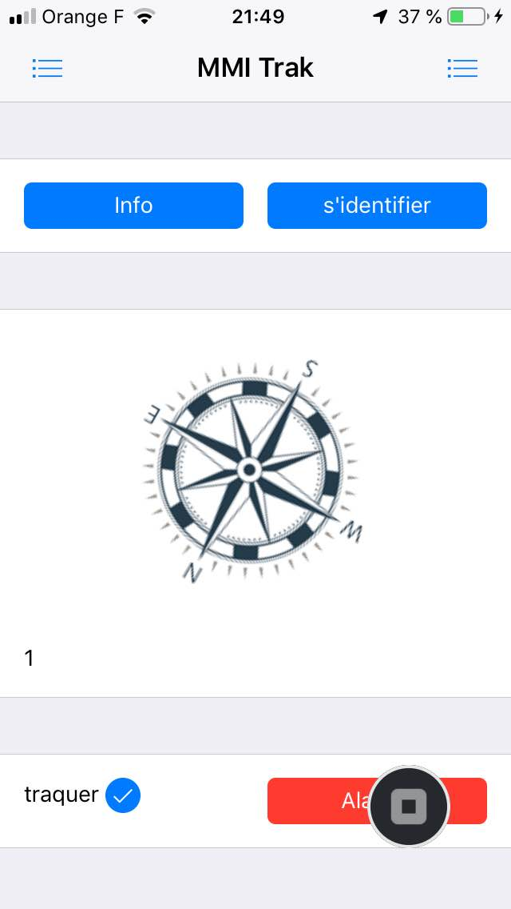

# M4B103-seance-7 \(2 mars\)

### exercice 1

Développer votre appli mobile en vueJS+Framework7 \(comme pour la séance 3\)


cordova ne  supporte plus  "compass" depuis sa version 9. Il va falloir utiliser "deviceorientation" accessible en html5 de base:

```text
window.addEventListener('deviceorientation', function(event) {
  
document.getElementById("maZoneInfo").innerHTML = "z : " + event.alpha + "\n x : " + event.beta + "\n y : " + event.gamma;
 
});
```

Le soucis, c'est qu'avec cette API de base, la rotation autour de l'axe des Z n'est pas indexé avec le nord par défaut \(enfin sur IOS :-\) \) mais initialisé au démarrage de l'application. Il va falloir donc la calibrer au démarrage...

voir: [https://www.w3.org/2008/geolocation/wiki/images/e/e0/Device\_Orientation\_%27alpha%27\_Calibration-\_Implementation\_Status\_and\_Challenges.pdf](https://www.w3.org/2008/geolocation/wiki/images/e/e0/Device_Orientation_%27alpha%27_Calibration-_Implementation_Status_and_Challenges.pdf)

code pour calibrer par rapport au nord sur IOS:

```text
var initialOffset = null;
window.addEventListener('deviceorientation', function(evt) {

 if(initialOffset === null && evt.absolute !== true
 && +evt.webkitCompassAccuracy > 0 && +evt.webkitCompassAccuracy < 50) {
 initialOffset = evt.webkitCompassHeading || 0;
 }

 var alpha = evt.alpha - initialOffset;
 if(alpha < 0) {
 alpha += 360;
 }

 // Now use our derived world-based `alpha` instead of raw `evt.alpha` value

}, false);
```

faites fonctionner la boussole avec ces éléments.

### exercice 2

faite un timer \(toutes les 30s\) qui enverra les coordonnées GPS vers votre serveur.

utiliser :

```text
setInterval(function(){
  navigator.geolocation.getCurrentPosition(maPosition);

},30000);

function maPosition(position) {
// position GPS récupérée
...
... position.coords.latitude ...
... position.coords.longitude ...
...
}
```

pour cela vous pouvez appeler votre API de mise à jours de la table coordonnées. ou au moins pour faire vos tests appeler "http://MONIP/mmitraceur/save.php?longitude=48.5423&latitude=4.6432&iduser=1". Dans ce cas, faites le fichier save.php qui sauve ces infos dans votre table coordonnées.

pour envoyer les datas vous pouvez utiliser:

```text
...
Framework7.request.get('http://149....82/mmiTrack/save.php?longi=48...&lat=...&id=1', function(data) {...});
...
```

ajouter un checkbox sur votre appli mobile pour activer ou non la sauvegarde des coordonnées GPS vers votre VPS



