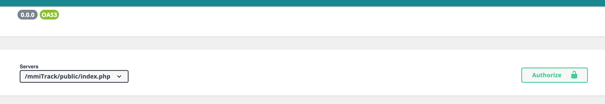

# M4B103-seance-9 \(16 Mars 9h30\)

## Objectifs

* Sécurisation des échanges avec l'API
* Authentification


Finir la séance 6, et recopier les URL et données à envoyer au format JSON dans un fichier texte qui sera déposé en fin de séance sur Moodle


## JWT

> [JSON Web Token \(JWT\)](https://jwt.io/) est un standard ouvert défini dans la RFC 7519[1](https://fr.wikipedia.org/wiki/JSON_Web_Token#cite_note-1). Il permet l'échange sécurisé de jetons \(tokens\) entre plusieurs parties. Cette sécurité de l’échange se traduit par la vérification de l’intégrité des données à l’aide d’une signature numérique. Elle s’effectue par l'algorithme [HMAC](https://fr.wikipedia.org/wiki/Keyed-Hash_Message_Authentication_Code) ou [RSA](https://fr.wikipedia.org/wiki/Chiffrement_RSA).
>
> ―[Wikipedia](https://en.wikipedia.org/wiki/JSON_Web_Token)

### Installer JWT dans votre API

Symfony dispose d'un bundle permettant d'intégrer JWT : [https://github.com/lexik/LexikJWTAuthenticationBundle](https://github.com/lexik/LexikJWTAuthenticationBundle)

```bash
composer require jwt-auth
```

Pour fonctionner vous devez ensuite disposer d'un couple de clé public/privé pour sécuriser les échanges :

```bash
$ mkdir -p config/jwt
$ openssl genpkey -out config/jwt/private.pem -aes256 -algorithm rsa -pkeyopt rsa_keygen_bits:4096
$ openssl pkey -in config/jwt/private.pem -out config/jwt/public.pem -pubout
```

Vous pouvez utiliser des clés déjà existantes, ou les générer avec d'autres commandes.

Il faut ensuite mettre à jour votre fichier .env.local en indiquant où trouver les fichiers de clés, et la "passphrase" 


```yaml
###> lexik/jwt-authentication-bundle ###
JWT_SECRET_KEY=%kernel.project_dir%/config/jwt/private.pem
JWT_PUBLIC_KEY=%kernel.project_dir%/config/jwt/public.pem
JWT_PASSPHRASE=test
###< lexik/jwt-authentication-bundle ###
```


### Configurer la sécurité

Il faut maintenant expliquer à Symfony, que lors d'une authentification réussie il devra générer un token JWT et l'utiliser dans les échanges entre les applications et l'API.

On va donc modifier le fichier security.yaml, pour qu'il intègre JWT et ressemble à :

```yaml
security:
    encoders:
        App\Entity\User:
            algorithm: auto

    # https://symfony.com/doc/current/security.html#where-do-users-come-from-user-providers
    providers:
        # used to reload user from session & other features (e.g. switch_user)
        app_user_provider:
            entity:
                class: App\Entity\User
                property: username
    firewalls:
        dev:
            pattern: ^/(_(profiler|wdt)|css|images|js)/
            security: false
        main:
            stateless: true
            anonymous: true
            provider: app_user_provider
            json_login:
                check_path: /authentication_token
                username_path: username
                password_path: password
                success_handler: lexik_jwt_authentication.handler.authentication_success
                failure_handler: lexik_jwt_authentication.handler.authentication_failure
            guard:
                authenticators:
                    - lexik_jwt_authentication.jwt_token_authenticator

    # Easy way to control access for large sections of your site
    # Note: Only the *first* access control that matches will be used
    access_control:
        - { path: ^/authentication_token, roles: IS_AUTHENTICATED_ANONYMOUSLY }

```

Attention à bien utiliser votre entité associée à vos utilisateur, et le mode de connexion \(username, email, ...\).

Dans ce fichier, on indique que l'URL d'authentification d'une application pour un échange de données en JSON se fera sur l'URL /authentication\_token, et nécessitera deux informations, le username et le password pour vous authentifier.

Cette route est ajoutée dans les access\_control \(ACL\), afin d'être accessible. Vous pourrez par la suite ajouter vos routes vers l'API afin de la sécuriser.

Il faut enfin, ajouter la route dans le fichier config/routes.yaml

```yaml
authentication_token:
    path: /authentication_token
    methods: ['POST']
```

Enfin, il faut dire à ApiPlatform qu'il doit utiliser le token pour les échanges, et on doit modifier le fichier config/packages/api\_platform.yaml pour ajouter les lignes ci-dessous:


```yaml
api_platform:
    swagger:
         api_keys:
             apiKey:
                name: Authorization
                type: header
```


Vous devriez donc avoir un fichier complet ressemblant à :

```yaml
api_platform:
    mapping:
        paths: ['%kernel.project_dir%/src/Entity']
    patch_formats:
        json: ['application/merge-patch+json']
    swagger:
        versions: [3]
        api_keys:
            apiKey:
                name: Authorization
                type: header

```

Si tout c'est bien passé vous devriez voir apparaître un bouton "Authorize" sur la page de documentation de votre API




Suivez la dernière partie de la documentation de Api Platform, pour intégrer l'authentification dans l'interface de votre API : [https://api-platform.com/docs/core/jwt/\#adding-endpoint-to-swaggerui-to-retrieve-a-jwt-token](https://api-platform.com/docs/core/jwt/#adding-endpoint-to-swaggerui-to-retrieve-a-jwt-token)


### Exercice :

Trouver l'URL et les données à envoyer depuis PostMan pour obtenir un token JWT. Cette information sera  nécessaire pour le fonctionnement de votre application.


Vous recopierez les éléments nécessaires dans un fichier texte qui sera à déposer sur Moodle en fin de séance.



Si vous rencontrez le message d'erreur "401 : JWT Not Found", et que vous utilisez Apache,

Alors il faut modifier le VirtualHost pour autoriser les tokens dans les en-têtes : [https://stackoverflow.com/questions/35266160/lexik-jwt-token-not-found/41723192\#41723192](https://stackoverflow.com/questions/35266160/lexik-jwt-token-not-found/41723192#41723192)


```yaml
RewriteEngine On
RewriteCond %{HTTP:Authorization} ^(.*)
RewriteRule .* - [e=HTTP_AUTHORIZATION:%1]
```

### Sécurisez votre API

Pour sécuriser votre API, il faut modifier le fichier security.yaml, pour qu'il sécurise les routes /api/

Le fichier devient donc :

```yaml
firewalls:
    dev:
        pattern: ^/(_(profiler|wdt)|css|images|js)/
        security: false

    api:
        pattern: ^/api/
        stateless: true
        anonymous: true
        provider: app_user_provider
        guard:
            authenticators:
                - lexik_jwt_authentication.jwt_token_authenticator
    main:
        anonymous: true
        json_login:
            check_path: /authentication_token
            username_path: username
            password_path: password
            success_handler: lexik_jwt_authentication.handler.authentication_success
            failure_handler: lexik_jwt_authentication.handler.authentication_failure
```

